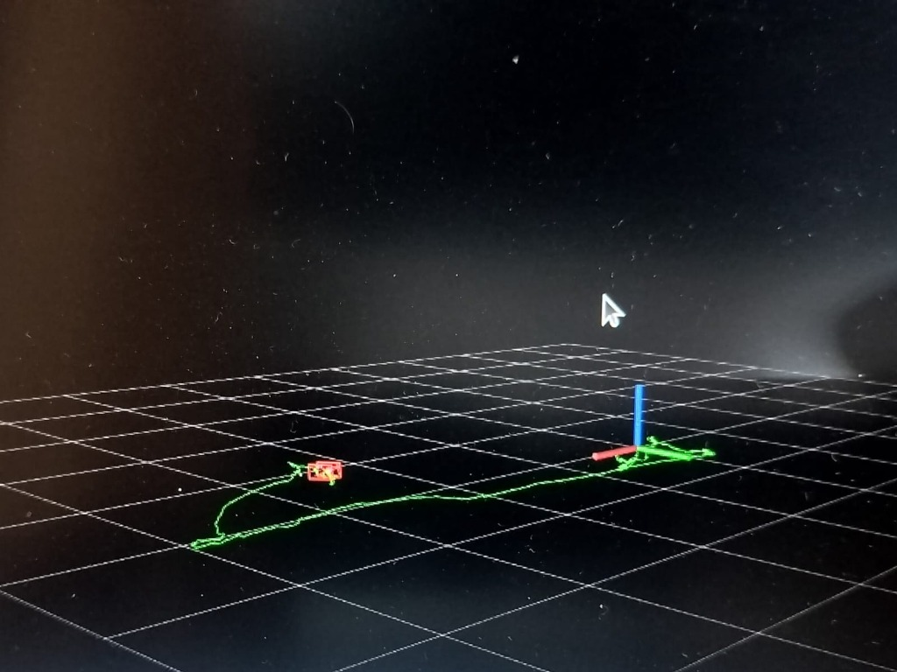

# HybridVIO-D455 - GPS-Denied Autonomous Drone Navigation via Visual-Inertial Odometry

A hybrid sensor fusion architecture for the Intel RealSense D455 that resolves ROS driver IMU contention to enable full-suite stereo-inertial state estimation on NVIDIA Jetson Orin Nano.

     

> In GPS-denied environments such as indoor spaces, subterranean structures, and urban canyons, standard UAV localization methodologies are rendered inoperative, necessitating alternative sensing modalities. While the Intel RealSense D455 provides an integrated IMU and camera suite for visual-inertial state estimation, standard `realsense2_camera` ROS driver execution suffers from USB endpoint contention, precluding simultaneous IMU and full-bandwidth camera acquisition. This hybrid architecture mitigates the bottleneck by deploying a decoupled Python and `librealsense2` IMU node with hardware-timestamp alignment, supplying uncorrupted inertial data to VINS-Fusion alongside the ROS camera driver. Configured for deployment on an NVIDIA Jetson Orin Nano companion computer, the system produces centimeter-level odometry to sustain autonomous drone flight control loops.


*Real-time flight path tracking in VINS-Fusion.*

## Problem Statement

**GPS Denial**
Autonomous navigation in GPS-denied environments (e.g., indoor facilities, subterranean tunnels, urban canyons) presents a critical localization gap. Pure inertial dead reckoning using solely IMU measurements diverges within seconds due to the double-integration of accelerometer bias and inherent sensor noise. A visual-inertial fusion approach, which constrains inertial drift using optical feature tracking, is necessary for sustained autonomous flight.

**D455 ROS Driver Contention**
When the standard `realsense2_camera` driver attempts to stream RGB, Depth, Stereo IR, and IMU data simultaneously over a single USB 3.x bus, the kernel USB subsystem raises `EBUSY` errors on the IMU endpoint. This contention causes intermittent IMU dropouts that corrupt the IMU pre-integration phase within VINS-Fusion, producing unbounded odometry drift. This hardware contention remains a known issue in the upstream `realsense-ros` repository when saturating the USB controller.

## Hybrid Architecture

```text
Intel RealSense D455
        |
        |-- USB 3.x Bus
        |       |
        |       |-- [IMU Endpoint]  -->  imu_publisher_node.py (Python / librealsense2)
        |       |                        Accel: 200 Hz | Gyro: 400 Hz
        |       |                        Hardware timestamp extraction + ROS time alignment
        |       |
        |       |-- [Camera Endpoints] --> realsense2_camera (ROS C++ driver)
        |                                  Stereo IR: 30 Hz | RGB: 30 Hz | Depth: 30 Hz
        |
        v
   /camera/imu  +  /camera/infra1  +  /camera/infra2  +  /camera/color  +  /camera/depth
        |
        v
   VINS-Fusion (Sliding Window Nonlinear Optimizer)
        |-- IMU Pre-integration (between keyframes)
        |-- Stereo Feature Tracking (KLT optical flow)
        |-- Loop Closure Detection (DBoW2)
        v
   /vins_estimator/odometry  @  30 Hz  -  6-DoF pose, centimeter-level accuracy
        |
        v
   Jetson Orin Nano (companion computer)  -->  Flight Controller (MAVLink / UART)
```

Hardware-timestamp alignment is critical because the native ROS time and the RealSense hardware clock naturally diverge due to USB transfer latency and host operating system clock jitter. The `imu_publisher_node.py` resolves this disparity by extracting the exact hardware timestamp via the `librealsense2` API. It computes a calibrated offset between the hardware clock and the host ROS clock during node startup, employing linear interpolation to accurately translate hardware events into the ROS time domain before publishing to VINS-Fusion.

## Sensor Configuration

Stream | Resolution | Rate | Transport | Topic
---|---|---|---|---
Stereo IR Left | `848x480` | `30 Hz` | ROS | `/camera/infra1/image_rect_raw`
Stereo IR Right | `848x480` | `30 Hz` | ROS | `/camera/infra2/image_rect_raw`
RGB Color | `848x480` | `30 Hz` | ROS | `/camera/color/image_raw`
Depth | `848x480` | `30 Hz` | ROS | `/camera/depth/image_rect_raw`
IMU (Accel) | N/A | `200 Hz` | `librealsense2` | `/camera/imu`
IMU (Gyro) | N/A | `400 Hz` | `librealsense2` | `/camera/imu`

## Component Responsibilities

Component | Technology | Rate | Output Topic
---|---|---|---
Camera Driver | `realsense2_camera` (C++) | `30 Hz` | `/camera/infra1`, `/camera/infra2`, `/camera/color`, `/camera/depth`
IMU Driver | `imu_publisher_node.py` (Python) | `200/400 Hz` | `/camera/imu`
State Estimator | VINS-Fusion (Optimization) | `30 Hz` | `/vins_estimator/odometry`

## Hardware Requirements

**Compute Platform**
NVIDIA Jetson Orin Nano (JetPack 5.x or later recommended). While CUDA and TensorRT are not directly utilized by the VINS-Fusion state estimator, the JetPack installation provides the necessary ARM64 library stack required for execution.

**Sensor**
Intel RealSense D455. The D435i may function with minor configuration adjustments, but the D455 features a longer baseline (95 mm versus 50 mm), which yields superior depth accuracy and extends the stereo feature triangulation range for outdoor and large-scale indoor environments.

## Software Dependencies

Package | Version | Role | Install Method
---|---|---|---
Ubuntu | 20.04 | Operating System | OS Image
ROS | Noetic | Middleware | `apt-get`
`librealsense2` | 2.x | Sensor API | `apt-get` or Source
`realsense-ros` | 2.x | ROS Camera Driver | Source (catkin workspace)
VINS-Fusion | N/A | State Estimator | Source (catkin workspace)
`ceres-solver` | 2.x | Nonlinear Optimization | Source
`python3-pyrealsense2` | 2.x | Python IMU Bindings | `pip3` / `apt-get`
`rospy` | Noetic | Python ROS Client | `apt-get`
`cv_bridge` | Noetic | OpenCV Integration | `apt-get`

## Installation

1. Clone the repository into your workspace:
```bash
cd ~/VIO/src
git clone https://github.com/Avishkar-byte/HybridVIO-D455.git
```

2. Build the workspace. The `-j2` flag limits parallel jobs to prevent memory exhaustion and thermal throttling on the Jetson Orin Nano.
```bash
cd ~/VIO
catkin_make -j2
```

3. Source the environment:
```bash
source devel/setup.bash
```

4. Ensure VINS-Fusion configuration files are correctly located in `src/VINS-Fusion/config/`.

## Usage

**Hybrid Mode (Primary)**
To launch the complete sensor suite using the custom Python IMU node, the ROS camera driver, and VINS-Fusion:
```bash
roslaunch vio_launch rs_d455_hybrid.launch
```
During startup, the console will emit "Resource temporarily unavailable" warnings. This represents the two drivers negotiating endpoints and is expected behavior. The system is operational once the log outputs `Initialization finish!`.

**Stereo-Only Mode (Fallback)**
If IMU contention persists or the IMU hardware fails, execute the pure stereo visual odometry fallback mode:
```bash
roslaunch vio_launch rs_d455_vins.launch
```

**Verification**
Run the following commands in separate terminals to verify subsystem health:

Topic | Expected Rate | Meaning
---|---|---
`/vins_estimator/odometry` | `~30-50 Hz` | VIO pose estimation output.
`/camera/imu` | `200-400 Hz` | Hardware-aligned IMU data.
`/camera/color/image_raw` | `~30 Hz` | RGB camera stream.

## Visualization

Execute the following to observe the real-time VIO system via RViz:
```bash
rosrun rviz rviz -d src/VINS-Fusion/config/vins_rviz_config.rviz
```
RViz will render the estimated 6-DoF path trajectory, the triangulated stereo point cloud, and the pose covariance ellipsoid reflecting the current uncertainty bounds of the state estimator.

## Troubleshooting

Symptom | Cause | Fix
---|---|---
"Resource temporarily unavailable" | Normal driver endpoint negotiation. | None required; wait for initialization.
IMU dropout causing drift | USB bandwidth saturation. | Ensure connection to a native USB 3.x port, bypassing hubs.
Initialization failure | Camera moved during IMU bias calibration. | Keep the camera stationary for the first 2 seconds after launch.
RViz shows no path | VINS-Fusion pending initialization. | Wait for the `Initialization finish!` string in the console.

## Deployment Context

This software architecture functions as a GPS-denied autonomous drone navigation system. The intended operational envelope encompasses environments devoid of satellite localization, including indoor warehouses, underground tunnels, bridge inspection corridors, and search-and-rescue structural interiors. Deployed on an onboard NVIDIA Jetson Orin Nano companion computer, the pipeline generates real-time pose estimates and transmits them to the flight controller via MAVLink or UART at the VIO output rate, directly closing the position control loop for autonomous navigation.

## Roadmap

- [x] Hybrid IMU/camera driver
- [x] Hardware timestamp alignment
- [x] VINS-Fusion integration
- [x] RViz visualization config
- [x] Stereo-only fallback mode
- [x] Jetson Orin Nano deployment
- [ ] Loop closure tuning for large-scale indoor maps
- [ ] MAVLink pose injection to PX4 flight controller
- [ ] EKF2 external vision fusion (`VISION_POSITION_ESTIMATE`)
- [ ] GPU-accelerated feature tracking on Jetson CUDA cores
- [ ] IMU bias online calibration
- [ ] rosbag evaluation suite with ground-truth comparison

## License

This project is licensed under the [MIT License](LICENSE).
